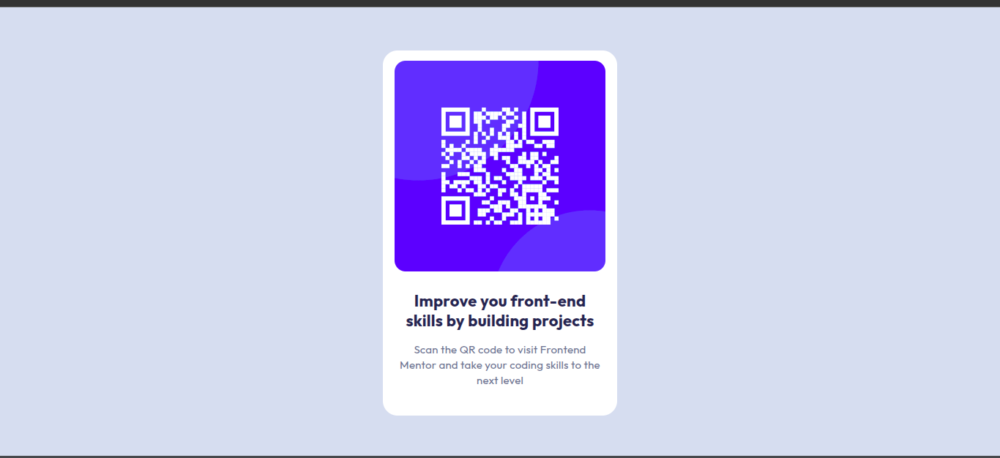

# Frontend Mentor - QR code component solution

This is a solution to the [QR code component challenge on Frontend Mentor](https://www.frontendmentor.io/challenges/qr-code-component-iux_sIO_H). Frontend Mentor challenges help you improve your coding skills by building realistic projects. 

## Table of contents

- [Overview](#overview)
  - [Screenshot](#screenshot)
  - [Links](#links)
- [My process](#my-process)
  - [Built with](#built-with)
  - [What I learned](#what-i-learned)
  - [Continued development](#continued-development)
  - [Useful resources](#useful-resources)
- [Author](#author)
- [Acknowledgments](#acknowledgments)

**Note: Delete this note and update the table of contents based on what sections you keep.**

## Overview

This README contains information regarding my first project under Frontend Mentor. All relevant info is contained in it. You can use the Table of Contents for easy navigation.

### Screenshot



### Links

- Solution URL: [Add solution URL here](https://github.com/MarcelUkeje/qr-code-component)
- Live Site URL: [Add live site URL here](https://marcelukeje.github.io/qr-code-component/)

## My process

I started off with the HTML markup, nesting the elements as they appeared.

I then consulted figma in order to get the font-styles, colours and other contributors to the layout. It was then a piece of cake to write the CSS for the page.

### Built with

- Semantic HTML5 markup
- CSS custom properties
- Flexbox

### What I learned

This project was beginner-friendly and so I did not find most of it difficult given my basic knowledge of HTML and CSS. However, I did learn something new. I learnt how to make a page look the same on screens of different sizes and I did that using the "vh" measure for the minimum height.

I also learned the basics of how to use figma as I constantly consulted the figma files contained in the project so as to aid my code.

The code snippet is shown below.

```css
body {
    background-color: #D5E1EF;
    display: flex;
    justify-content: center;
    align-items: center;
    flex-direction: column;
    min-height: 100vh;
}
```

### Continued development

At the moment, I still struggle with getting the page to appear exactly as I want it to.

For example, I want to be able to choose whether or not I want the page to be scrollable. This was not part of the requirements but I find it useful to have full control over my work.

I want to get to a point where I can easily create any effect I want and can easily spot the cause of undesirable effects. That is what I am working towards at the moment.


### Useful resources

- [The Odin Project](https://www.theodinproject.com/paths/foundations/courses/foundations) - I have found TOP to be very helpful, and it was a pleasant surprise to see that some of the creators of the resources which are linked inside of it are mentors in the community.

## Author

- Frontend Mentor - [@MarcelUkeje](https://www.frontendmentor.io/profile/MarcelUkeje)


## Acknowledgments

I found [Vanza Setia's](https://github.com/vanzasetia) code helpful in getting my page to be responsive.

